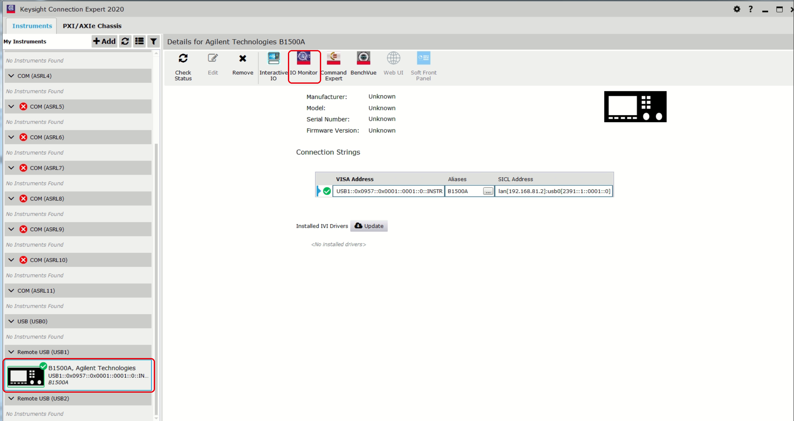
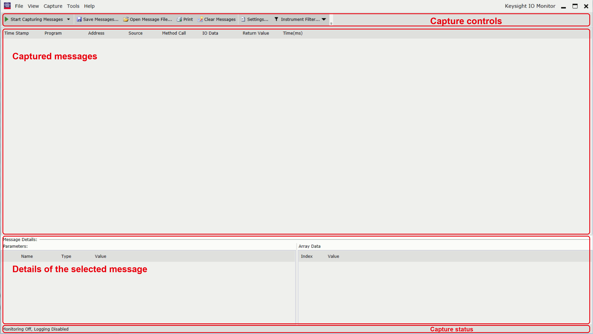
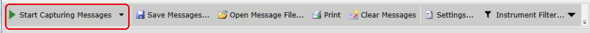
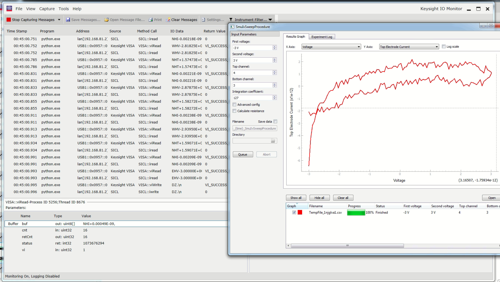
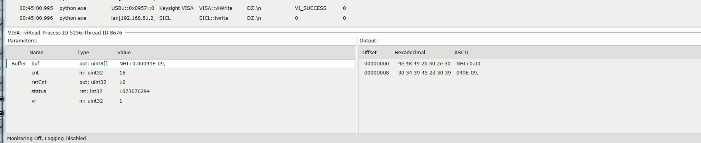
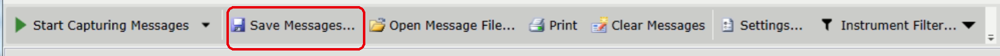

####################
Command Interception
####################

Sometimes, you may want to track the commands that are sent to the instrument. For example, if you want to understand what happens during a complex measurement that is built from several scripts. Or, you can use it for debugging purposes.

For scripts based on this package, you can use :func:`~probe_station.logging_setup.setup_file_logging` function.

.. In parallel, a log is always written to a ``logs`` folder in the project directory itself. This one starts at script startup rather than at the moment of queuing, and is always there even if the measurement was not saved, which makes it easier to debug the problems reported by users.
.. move to logging part

.. code-block:: python

    from probe_station.logging_setup import setup_file_logging

    setup_file_logging("logs")

It saves all commands sent to the instrument into a ``logs`` folder. When a measurement is queued with *store measurement* enabled, such a folder is created inside the folder with measurement results, so that the log stays next to the data it describes. It's already used in all of existing :ref:`runners <learning-package/structure:Measurement scripts>`.

Under the hood, it sets ``DEBUG`` level logging for the :mod:`pyvisa` logger, so that all commands sent to the instrument are logged.

.. code-block:: python

    logging.getLogger("pyvisa").setLevel(logging.DEBUG)

Keysight IO Monitor
===================

Alternatively, as a more general approach that you can use for any script communicating using :ref:`VISA <explanation/connection:visa>` or :ref:`SICL <explanation/connection:physical and network layers>`, you can use `Keysight IO Monitor <https://helpfiles.keysight.com/IO_Libraries_Suite/English/IOLS_Linux/IOMonitor/Content/Welcome.htm>`__.

Open the monitor
----------------

Select your instrument in Keysight Connection Expert and press :guilabel:`IO Monitor` in the toolbar of the details panel on the right.

   Keysight Connection Expert. The instrument is selected in the list on the left, the details panel with the toolbar is on the right.

Start capturing
---------------

The window that opens is empty: it shows nothing that happened before the capturing was started.

   The IO Monitor window before the capturing is started.

Press :guilabel:`Start Capturing Messages`. The status bar in the bottom left corner switches from ``Monitoring Off`` to ``Monitoring On``.

   Toolbar of the IO Monitor window.

Run the script
--------------

Start your measurement while the capturing is on. Every call appears as a row with a timestamp, the program that made it (``python.exe`` for our scripts), the address, the method (``VISA::viWrite``, ``SICL::iread``, ...) and the data itself.

   An SMU IV sweep running in a :ref:`runner <learning-package/structure:Measurement scripts>` window, with its commands captured on the left.

Each operation shows up twice, because in our setup :ref:`VISA delegates to SICL <explanation/connection:i/o layer>`: once as a ``VISA::`` call on the USB address of the instrument, and once as the corresponding ``SICL::`` call on the ``lan[...]`` address of the mainframe. Both lines describe the same message. You can change this behavior in :guilabel:`Settings`.

Inspect and save
----------------

Press :guilabel:`Stop Capturing Messages` and click on a row to see the :guilabel:`Message Details` pane: the parameters of the call and the raw bytes of the message in hex and ASCII.

   Details of a single ``viRead`` that returned one measurement point.

:guilabel:`Save Messages...` writes the captured session to a file, so that you can keep it next to the measurement data or attach it to a bug report.

   Saving a captured session.
