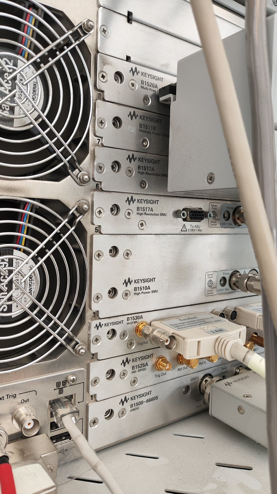
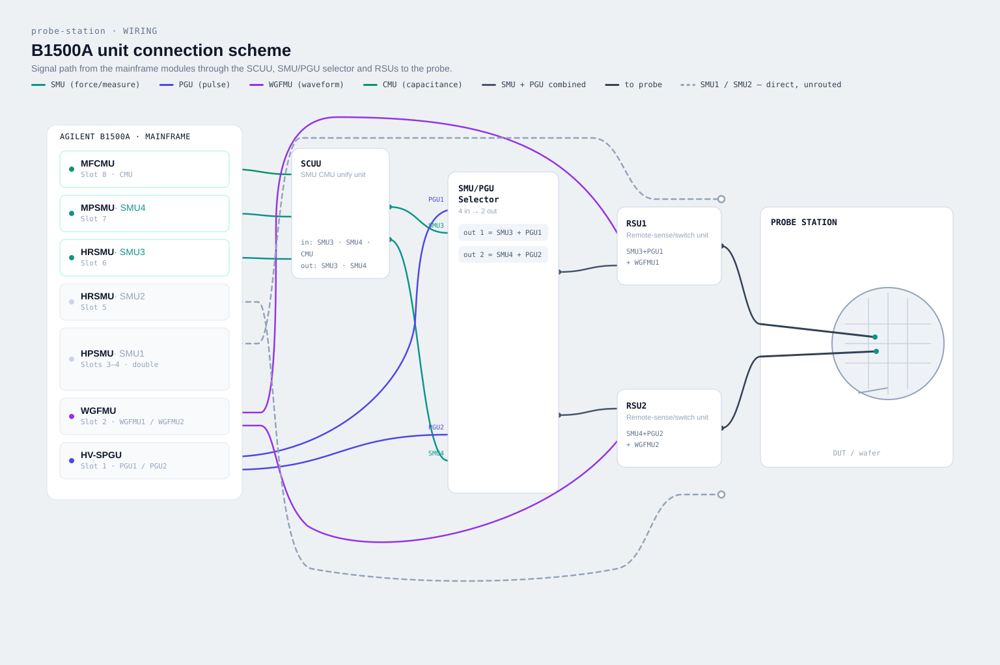

########
Hardware
########

Agilent/Keysight B1500 is a semiconductor parameter analyzer. The main features of the device are:

* Modularity - the device has 10 slots for different units, which can be combined to perform different measurements.
* No re-cabling - the device has multiple switching units that allow to switch between units programmatically (link to section), without changing the cable configuration. E.g. you can measure high-speed IV curve using WGFMU, programmatically switch to CMU and measure CV curve, and then measure DC IV curve using SMU, all without changing the cables.

Each unit is inserted into a slot and connected to the mainframe (see :ref:`the photo below <b1500-modules>`). All of the units except HPSMU (High Power SMU) take 1 slot, while HPSMU takes 2 slots. Each unit has 1 or 2 channels.

In our setup, there are following installed units (starting from bottom to top, from slot 1 to slot 8):

* HV-SPGU (High Voltage Semiconductor Pulse Generator Unit)
* WGFMU (Waveform Generator/Fast Measurement Unit)
* HPSMU (High Power Source Measure Unit)
* HRSMU (High Resolution Source Measure Unit)
* HRSMU (High Resolution Source Measure Unit)
* MPSMU (Medium Power Source Measure Unit)
* MFCMU (Medium Frequency Capacitance Measurement Unit)

.. _b1500-modules:

   Rear view of our B1500A. Slot numbers are printed on the left edge of each
   slot, counting upwards from slot 1 at the bottom. The B1510A HPSMU uses slots 3 and 4.

SMU naming conventions
----------------------

Since there are multiple SMUs in the setup, and it's not convenient to refer to them by their slot numbers, we use the naming conventions recommended by Keysight (see :ref:`Users Guide page 2-17 <users-guide>`). The SMUs are named as SMU1, SMU2, SMU3, SMU4, where SMU1 is the SMU with the lowest slot number in the setup (in our case, it's HPSMU in slot 3), SMU2 is the second SMU (in our case, it's HRSMU in slot 5), and so on.

Selectors
---------

Selectors or switching units are used to switch between different units without changing the cable configuration. The main idea is that you can connect multiple units to the same output and then programmatically switch between them. This is useful when you want to perform different measurements on the same device under test without having to rewire the setup.

In our setup, there are 3 types of selectors:

* SCUU (SMU CMU unify unit) - used to switch between 2 SMUs and 1 MFCMU units (:ref:`photo <scuu-photo>`).
* SMU/PGU selector - used to switch between 2 SMUs and 2 channels of 1 SPGU unit (:ref:`photo <smu-pgu-selector-photo>`). In our setup, the inputs are not from SMUs directly, but from SCUU output. Therefore, you can switch between 2 SMUs and 1 MFCMU using SCUU and then switch between that output and SPGU using SMU/PGU selector.
* RSU (Remote-sense and switch unit) - used to switch between 1 WGFMU channel and 1 SMU unit (:ref:`photo <rsu-photo>`). In our setup, the inputs are not from SMUs directly, but from SMU/PGU selector output. Therefore, you can switch between 2 SMUs and 1 MFCMU using SCUU, then switch between that output and SPGU using SMU/PGU selector, and then switch between that output and WGFMU using RSU.

.. grid:: 1 1 3 3
   :gutter: 3

   .. grid-item::

      .. _scuu-photo:

      .. figure:: images/b1500-scuu.jpg
         :target: ../_images/b1500-scuu.jpg

         **SCUU.** Two SMU inputs and one MFCMU input, two outputs.

   .. grid-item::

      .. _smu-pgu-selector-photo:

      .. figure:: images/b1500-smu-pgu-selector.jpg
         :target: ../_images/b1500-smu-pgu-selector.jpg

         **SMU/PGU selector.** Both channels have separate SMU and PGU inputs and one shared output.

   .. grid-item::

      .. _rsu-photo:

      .. figure:: images/b1500-rsu.jpg
         :target: ../_images/b1500-rsu.jpg

         **RSU.** Sits outside the mainframe, next to the probe station: one input from the WGFMU, one from the SMU.

Wiring
------

Wiring is summarized in the figure below. In short, there are 2 main paths that allow different kinds of measurements. Output on the left allows to use SMU4, MFCMU, 2nd channel of SPGU and 2nd channel of WGFMU. Output on the right allows to use SMU3, MFCMU, 1st channel of SPGU and 1st channel of WGFMU.

SMU1 and SMU2 are connected directly to probe station and used when more than 2 probes are required.

.. seealso::

    :ref:`SMU naming conventions <learning-package/hardware:SMU naming conventions>`

Choosing the right unit for voltage measurements
------------------------------------------------

SMU, WGFMU, HV-SPGU has similar functionality but differ in characteristics and therefore are suited for different applications. Short summary of when to use which unit:

.. list-table::
   :widths: 30 70 50 50
   :header-rows: 1

   * - Unit
     - Minimal measured current
     - Maximal force voltage
     - Minimal time per point
   * - SMU
     - :math:`\gtrsim 10^{-11}` A
     - :math:`100` V
     - :math:`\gtrsim 30` ms
   * - WGFMU
     - :math:`\gtrsim 10^{-6}` A
     - :math:`\pm 5` V (bipolar), :math:`10` V (unipolar)
     - :math:`\sim 10` ns
   * - SPGU
     - --
     - :math:`40` V
     - :math:`\sim 10` ns

In short, you should use SMU if you're fine with measurement time per point :math:`\gtrsim 30` ms, WGFMU if you need to measure faster than that, but don't need high voltage, and HV-SPGU if you need to apply high voltage using short pulses without current measuring.

Switching between units
-----------------------

Software
========

As with other instruments, B1500 can be controlled via SCPI commands. 

.. Про remote usb

Details
=======

To send a command for specific unit, you need to specify the slot number. E.g. to enable the output of 

WGFMU specifics
---------------

Contrary to all other units, 

Under the hood, it also sends SCPI commands, but the formatting is a bit different. In general you can reverse engineer the commands using keysight IO. That will probably increase the speed of measurements for some cases. Additionally, that will probably allow you to use internal program memory for WGFMU commands as well that can be helpful when extremely small delays are required (e.g. if you need to measure retention on ucs scale after fast high-voltage write pulse produced by SPGU)

.. important::

    By default (e.g. after B1500 reset), the SMU/PGU output is disabled. Always remember to enable SMU output after the end of your measurements, so that people who don't know how to work with that, still can use SMUs without changing cables.